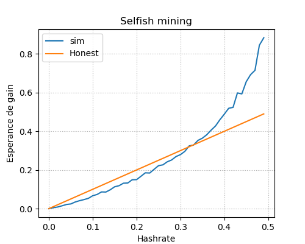

# Simulations

## Attack 1 + 2

This attack simulate an attack during  3 block : if the first block is found by a honest miner the attacker stop and the simulation end , if not the attacker attack for two more block. Alice is the attacker and Bob the network/ honest miners.

Strategy  1+2 :
|     | R (reward) | H (block mined , valid, height) | Probability of occurrence of an event |
|:---:|:----------:|:-------------------------------:|:-------------------------------------:|
|  B  |      0     |                1                |                   p                   |
| AAA |      3     |                3                |                  q^3                  |
| AAB |      2     |                2                |                  pq^2                 |
| ABA |      2     |                2                |                  pq^2                 |
| ABB |      0     |                2                |                  p^2q                 |

With p , the probability of Bob to find a block and q , the probability of Alice to find a block (q<0,5).

E[R] = 0xp + 3q^3 + 2pq^2 + 2pq^2 + 0p^2q

E[H]= 1p + 3q^3 + 2pq^2 + 2pq^2 + 2p^2q

rendement = E[R]/E[H]  <=> q> 2-1

  

Answers :

Experimental : minimum Esperance de gain, Hashrate[idx[1]] = 0.41

N = 10000 p = 41.4 %  rendement exp = 0.4185781354795439

N = 10000 p = 41.4 %  rendement th = 0.41390132190841356

It will be profitable for the miner if he own at least 41.4% of the power network.

 

## Selfish mining

This attack consists of hidding blocks and not brodcast it, to create a hidden fork. Then to brodcast it at the time when the network catches up with the selfish miner. The hidden fork will be taken into account as it's longer. By doing this the selfish miner ensure to increase its return.

  

Is it always profitable?

  

Answers :
Experimental : minimum Esperance de gain, Hashrate[idx[1]] = 0.33
Simulated probability : 0.3287980174451271

It is not always profitable, it will be profitable for the miner if he own at least 33% of the power network.

 

## Double spendings

This attack consists of mining secretly until the attack reaches a blockchain with a length greater than the network chain , the transaction tx that was previously on the blockxahin disappear as the previous official block are discareded. The attacker has succed to reversed the trasbcation to ensure to increase its return.

  

Answers:

Experimental : minimum Esperance de gain  z=10 , A=3, Hashrate[idx[1]] = 0.44
Experimental : minimum Esperance de gain z=6 , A=3, Hashrate[idx[1]] = 0.43
Experimental : minimum Esperance de gain z=6 , A=10, Hashrate[idx[1]] = 0.46

It will be profitable for the miner if he own at least 43% of the power network, more there it need confirmations more it's profitable.
